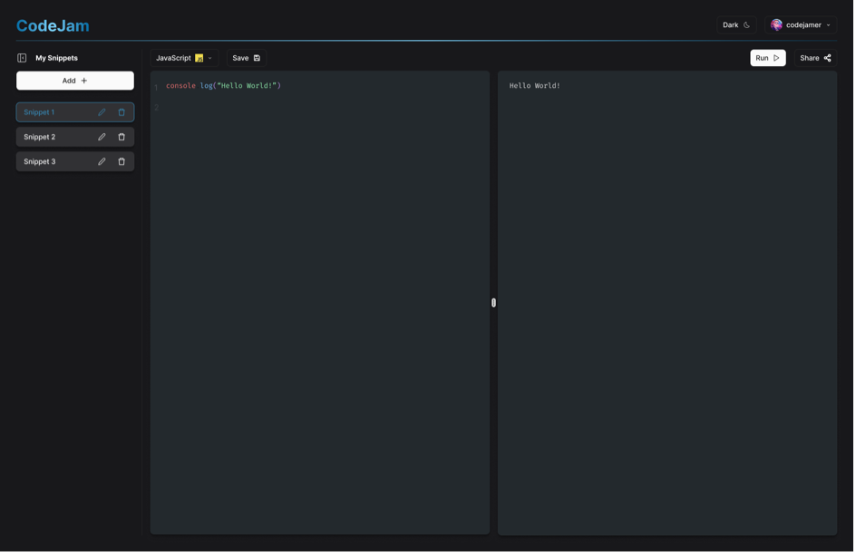
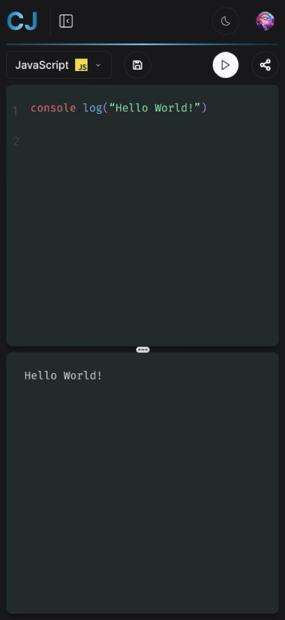

# CodeJam

Welcome to CodeJam!

CodeJam is your all-in-one playground for writing and running code in multiple programming languages — instantly and effortlessly.

Whether you’re experimenting with a new algorithm, testing a quick idea, or building your personal library of code snippets, CodeJam helps you do it all in one sleek and responsive interface.

## Screenshots

<div style="display: flex; gap: .23em">
<!--  -->


<!--  -->

</div>

## 🧱 Architecture

CodeJam is a collaborative web application designed to streamline coding challenges and team-based problem solving. It is built on a microservices architecture, containerized with Docker and orchestrated via Docker Compose.

Following a DevOps approach, the project integrates continuous integration, automated testing, and deployment pipelines to ensure reliability and scalability. This setup provides a production-like environment from development to release, facilitating collaboration and maintaining consistent code quality.

## 🏁 Get Started

Clone the [GitHub Project](https://github.com/WildCodeSchool/2409-wns-rouge-codejam.git).

Create and setup the `.env` files located at the root of the project directory.

### Run the application

First make sur the Docker engine (daemon) is running in the background by opening Docker Desktop.

Then, run the following command to start the project in development mode:

```sh
docker compose up --build
```

Finally open a browser and visit the URL: http://localhost:8080

### Stop the application

To stop the containers, run:

```sh
docker compose down
```

or simply press <kbd>Ctrl</kbd>+<kbd>C</kbd> for a graceful stop.

## 🧪 Testing

### Run backend tests

To run backend unit & integration tests:

```sh
cd backend
pnpm run test:db
```

> **Note:**
> Due to the use of `tsx` to run TS files in Node and the use of ESM syntax (`"type": "module"` in `package.json` ), the option `NODE_OPTIONS="$NODE_OPTIONS --experimental-vm-modules"` need to be added to the `pnpm` script to activate ESM support with JEST tests
> (cf. [documentation](https://jestjs.io/docs/next/ecmascript-modules)).

### Run frontend tests

To run frontend unit & integration tests:

- in _single-run_ mode:

  ```sh
  cd frontend
  pnpm run test
  ```

- in _watch_ mode:

  ```sh
  cd frontend
  pnpm run test:watch
  ```

## 🚧⛁ Database

### Reset the database

1. Stop the container (see [step #1](#🚧Populate-the-database-with-initial-data)).

2. Cleanup unused data (stopper containers, unused networks, dangling (not tagged nor referenced) images, unused images, and build cache), unused volumes (execept names ones) skipping confirmation prompts:

```sh
docker system prune --volumes -af
```

3. Then, manually delete the Docker named volume:

```sh
docker volume ls
docker volume rm codejam_dbdata
```

4. Initialize the database from a SQL dump file (see [next section](#Populate-the-database-with-initial-data)).

### Populate the database with initial data

1. First, make sure the application is up and running (see [Run the application](#Run-the-application)).

2. Initialize the database from a SQL dump file:

```sh
cd ./backend
pnpm run seed:db
```

3. Connect to the application with one of the following user credentials (⚠️ for development only!):

- _user (free):_

  ```
  username: codejamer
  email: codejamer@email.com
  password: My-Super-Password-123
  ```

- _user (premium):_

  ```
  username: codejamer+
  email: codejamer-premium@email.com
  password: My-Super-Premium-Password-123
  ```

- _admin (premium):_

  ```
  username: admin
  email: admin@email.com
  password: Root_123_codejam
  ```

### 🚧 Migrations

...

## 🚧🚀 Deploy

### 🚧 Configuration

...

### 🚧 Add a new service

...

### 🚧 Data backup

...

### 🚧 Data migration

...

## 🤝 Contribute

### Commit

This project follows the [conventionnal commits](https://www.conventionalcommits.org/en/v1.0.0/#summary) specification and enforces it using `husky` and `commitlint`.

If you’re not familiar with this syntax, you can use the following command to help you write your Git commit message:

```sh
pnpm commit
#OU
npx cz
```

## Built with 💖 by

- [Audrey](https://github.com/audrey-donjon)
- [Denis](https://github.com/ddZ6ii)
- [Ugo](https://github.com/ugenjoy)
- [Vlad](https://github.com/codeIsHard2023)

## and with


